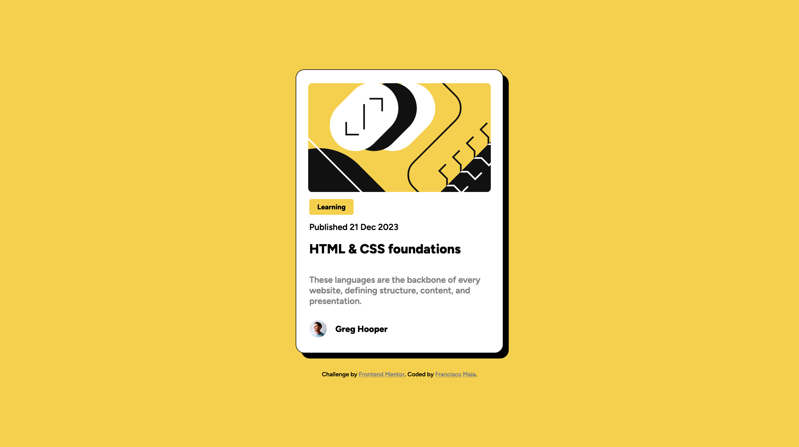

# Frontend Mentor - Blog preview card solution

This is a solution to the [Blog preview card challenge on Frontend Mentor](https://www.frontendmentor.io/challenges/blog-preview-card-ckPaj01IcS).

## Table of contents

- [Overview](#overview)
  - [Screenshot](#screenshot)
  - [Links](#links)
- [My process](#my-process)
  - [Built with](#built-with)
  - [What I learned/practiced](#what-i-learned/practiced)
  - [Continued development](#continued-development)
  - [Useful resources](#useful-resources)
- [Author](#author)

## Overview

### Screenshot



### Links

- Solution URL: [Add solution URL here](https://xico26.github.io/fm-blog-preview-card)

## My process

### Built with

- Semantic HTML5 markup
- CSS custom properties
- Flexbox
- Media Queries

### What I learned/practiced

- CSS Media Queries

```css
@media (max-width: 768px) {
    .wrapper {
        --w: calc(325px - 3rem);
        width: var(--w);
        height: calc(500px - 3rem);
    }
    .head-img {
        width: 279px;
    }
}
```

- Shadows

### Useful resources

- [Media Queries on W3Schools](https://www.w3schools.com/css/css_rwd_mediaqueries.asp) - Reminder for media queries
- [CSS Box Shadow on W3Schools](https://www.w3schools.com/css/css3_shadows_box.asp) - How to use box shadowing

## Author

- Website - [Francisco Maia](https://xico26.github.io)
- Frontend Mentor - [@yourusername](https://www.frontendmentor.io/profile/Xico26)